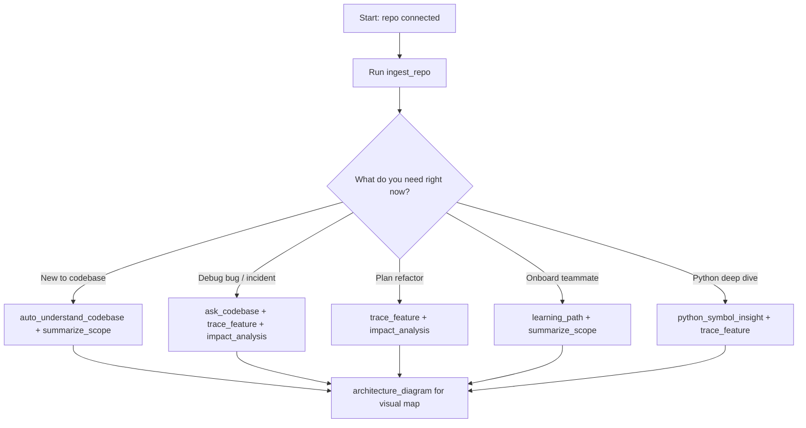
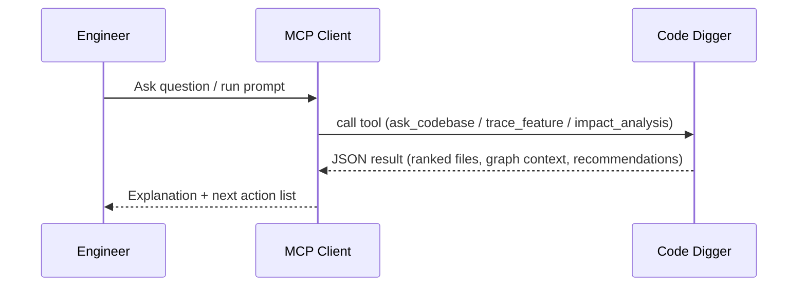

# Code Digger MCP

Code Digger is an MCP server that turns large codebases into an architecture map you can query with natural language.

It is built for engineering teams that need faster onboarding, safer refactors, and lower cognitive load in fast-growing repositories.

## 30-second quickstart

```bash
npm install
npm run build
npm run install:cursor
```

Then restart your MCP client and run:

1. `ingest_repo` with your repository root path
2. `auto_understand_codebase` with low token settings
3. `architecture_diagram` for a high-level visual map

## Quick links

- [Quick copy: Orientation](#quick-copy-orientation)
- [Quick copy: Feature investigation](#quick-copy-feature-investigation)
- [Quick copy: Bug triage](#quick-copy-bug-triage)
- [Quick copy: Onboarding](#quick-copy-onboarding)
- [Quick copy: Refactor planning](#quick-copy-refactor-planning)
- [Quick copy: Performance investigation](#quick-copy-performance-investigation)
- [Quick copy: Python deep dive](#quick-copy-python-deep-dive)
- [Quick copy: Low-token mode](#quick-copy-low-token-mode)

### Quickstart options (choose one by goal)

If the 3-step sequence above feels too abstract, use this decision guide:



### Quickstart command packs (exhaustive practical variants)

#### Pack A: Fast orientation (default for any new repo)

1. `ingest_repo`
2. `summarize_scope` (no args)
3. `auto_understand_codebase` (`tokenBudget: 350`, `style: "compact"`)
4. `architecture_diagram` (`maxNodes: 10`)

What you get:

- High-level domain map
- Critical files by fan-in
- One diagram you can share in design/docs

#### Pack B: Low-token orientation

1. `ingest_repo`
2. `auto_understand_codebase` (`tokenBudget: 250`, `style: "caveman"`)
3. `architecture_diagram` (`maxNodes: 8`, `style: "caveman"`)

What you get:

- Minimal text volume
- Small architecture graph
- Faster responses in constrained contexts

#### Pack C: Feature understanding (recommended before edits)

1. `ask_codebase` with a feature question
2. `trace_feature` with same feature phrase
3. `impact_analysis` on target file before editing

What you get:

- Top relevant files
- Deterministic `canonicalFlow`
- Risk score + direct/transitive blast radius

#### Pack D: Bug triage / incident response

1. `ask_codebase` for symptom and failing behavior
2. `trace_feature` for affected user journey
3. `impact_analysis` on suspected hotspot files
4. `summarize_scope` on narrowed folder (optional)

What you get:

- Likely failure points
- Multi-hop dependency context
- Safer rollback/fix sequencing

#### Pack E: Onboarding by seniority

1. `summarize_scope`
2. `learning_path` (`beginner|senior|architect`)
3. `trace_feature` for one core journey

What you get:

- Read order
- Role-specific checklist
- Context-rich starter path

#### Pack F: Python architecture deep dive

1. Ensure `python3` works
2. `ingest_repo`
3. `python_symbol_insight` for service/class/function
4. `trace_feature` for runtime flow

What you get:

- Decorators + inheritance + async details
- Python call context
- Better symbol-level reasoning

## Why this exists

Large codebases fail teams in predictable ways:

- New engineers do not know where to start.
- Architecture intent is scattered across many files.
- Refactor blast radius is hard to estimate.
- Teams spend too much time re-learning the same system context.

Code Digger compresses that complexity into structured outputs: domain maps, dependency-aware answers, feature traces, and risk estimates.

## Core capabilities

- Semantic retrieval across the full repository
- Architecture/domain compression from file-level metadata
- Dependency + reverse dependency graph reasoning
- Feature path reconstruction (`trace_feature`)
- Blast-radius estimation (`impact_analysis`)
- Guided onboarding by role (`learning_path`)
- Python AST insights (decorators, inheritance, async, call graph)
- Auto-understanding mode for zero-question orientation
- Mermaid architecture diagram generation
- Token-control options (`tokenBudget`, `maxNodes`, `style: caveman`)

## How it works

1. `ingest_repo` recursively indexes your codebase.
2. Indexing extracts symbols, imports, capability tags, and token vectors.
3. It builds dependency and reverse dependency graphs.
4. MCP tools answer architecture and implementation questions using that index.

---

## Exhaustive installation guide

### 1) Prerequisites

- Node.js `>=18` (Node 20+ recommended)
- npm
- Optional but recommended: `python3` on `PATH` (enables deep Python AST extraction)

Verify:

```bash
node --version
npm --version
python3 --version
```

### 2) Clone and install dependencies

```bash
git clone <your-repo-url>
cd code-digger
npm install
```

### 3) Build TypeScript output

```bash
npm run build
```

Expected server entrypoint after build:

- `dist/main.js`

### 4) Optional local quality checks

```bash
npm run lint
npm test
```

### 5) Install MCP config for your client

Run one of these from the repository root:

```bash
npm run install:claude
npm run install:cursor
npm run install:codex
npm run install:antigravity
```

Default config paths used by installer:

- Claude: `~/.claude/mcp.json`
- Cursor: `~/.cursor/mcp.json`
- Codex: `~/.codex/mcp.json`
- Antigravity: `~/.antigravity/mcp.json`

### 6) Custom config path (fully supported)

```bash
npm run install:mcp -- --platform cursor --config /absolute/path/to/mcp.json
```

Supported platform values:

- `claude`
- `cursor`
- `codex`
- `antigravity`

### 7) Restart your MCP client

Restart Claude/Cursor/Codex/Antigravity so it reloads MCP servers.

### 8) Verify server command

All installers register the server as stdio command:

```bash
node /absolute/path/to/code-digger/dist/main.js
```

Manual run for debugging:

```bash
node dist/main.js
```

### 9) Manual MCP JSON setup (if you do not use installer)

```json
{
  "mcpServers": {
    "code-digger": {
      "command": "node",
      "args": ["/absolute/path/to/code-digger/dist/main.js"]
    }
  }
}
```

Platform-specific manual notes are in `docs/PLATFORM_GUIDE.md`.

### 10) First-run initialization sequence

Run these tools in order:

1. `ingest_repo` (required once per repo snapshot)
2. `summarize_scope` (no args) for architecture baseline
3. `auto_understand_codebase` for compact briefing
4. `architecture_diagram` for dependency map
5. `trace_feature` for an important user flow
6. `impact_analysis` before modifying high-fanout files

---

## Complete tool reference (every tool + how to use)

Important: all tools except `ingest_repo` require a successful index in memory for the current server session.

### 1) `ingest_repo`

Builds or refreshes the repository index.

Input:

```json
{ "rootPath": "/absolute/path/to/repo" }
```

Usage notes:

- `rootPath` should be an absolute path.
- Re-run after major code changes.
- Required before any other tool in a fresh session.

### 2) `ask_codebase`

Answers natural-language implementation questions and returns relevant files with scores.

Input:

```json
{
  "question": "How does auth session invalidation work?",
  "topK": 8
}
```

Usage notes:

- `question` is required.
- `topK` is optional (default `8`).
- Returns top files, file summaries, capability tags, and architecture context.

Best for:

- "Where is X implemented?"
- "How does Y flow through the system?"
- "Which files own this behavior?"

### 3) `summarize_scope`

Summarizes repository, folder, or file scope.

Input examples:

```json
{}
```

```json
{ "scopePath": "backend/auth" }
```

Usage notes:

- No `scopePath` gives repo-level overview.
- `scopePath` can be folder or file substring.
- Returns language breakdown, capabilities, and representative files.

### 4) `trace_feature`

Builds an end-to-end feature hypothesis from semantic relevance + dependency signals.

Input:

```json
{ "feature": "checkout retry and payment confirmation flow" }
```

Usage notes:

- `feature` is required and should be specific.
- Returns likely trace files with upstream/downstream links.
- Includes `canonicalFlow` for one deterministic "best narrative path" through the feature.
- Includes `priorityFlow` and `prioritizedBridgeFiles` for alternate supporting routes.
- Useful before changing cross-cutting behavior.

### 5) `impact_analysis`

Estimates blast radius of changing a file/module.

Input:

```json
{ "filePath": "src/services/billing.ts" }
```

Usage notes:

- `filePath` is required.
- Can be full path or suffix match.
- Returns direct dependencies, direct dependents, `riskScore`, and recommendation.

### 6) `learning_path`

Generates a role-specific onboarding/read-order plan.

Input:

```json
{ "role": "beginner" }
```

Allowed `role` values:

- `beginner`
- `senior`
- `architect`

Usage notes:

- Returns a step-by-step plan and suggested domains.
- Great for onboarding docs and handoffs.

### 7) `python_symbol_insight`

Performs deep Python symbol inspection from AST data.

Input:

```json
{ "symbol": "AuthService" }
```

Usage notes:

- Works best when `python3` is available during indexing.
- Returns matching classes/functions, decorators, bases, async metadata, and calls.
- If AST data is unavailable, output may be sparse.

### 8) `auto_understand_codebase`

Produces automatic architecture understanding without needing a user question.

Input:

```json
{
  "tokenBudget": 400,
  "style": "compact"
}
```

Allowed `style` values:

- `compact` (default)
- `caveman` (minimal-token style)

Usage notes:

- `tokenBudget` default is `500`.
- Use `tokenBudget: 250-400` + `style: "caveman"` for low-token workflows.
- Returns overview, top domains, critical files, Python flows, and execution plan.

### 9) `architecture_diagram`

Generates Mermaid dependency diagram centered on high fan-in modules.

Input:

```json
{
  "maxNodes": 12,
  "style": "compact"
}
```

Allowed `style` values:

- `compact` (default)
- `caveman`

Usage notes:

- `maxNodes` default is `14`.
- Low-token recommendation: `maxNodes: 8-12`, `style: "caveman"`.
- Returns Mermaid text, narrative, and node count.

---

## Recommended usage workflows

### Workflow A: First-time orientation

1. `ingest_repo`
2. `summarize_scope` (no args)
3. `auto_understand_codebase`
4. `architecture_diagram`

### Workflow B: Answer a specific engineering question

1. `ask_codebase` with concrete question
2. `trace_feature` for the same area
3. `impact_analysis` for planned edit targets

### Workflow C: Onboarding plan by seniority

1. `summarize_scope`
2. `learning_path` with `beginner|senior|architect`
3. Use returned domain hints as read order

### Workflow D: Python-heavy service deep dive

1. Ensure `python3` is available
2. `ingest_repo`
3. `python_symbol_insight`
4. `trace_feature` for runtime path context

---

## Prompt cookbook (copy-paste, with outputs explained)

Use these directly in any MCP-enabled assistant after indexing.

### 1) Bug triage

Prompt:

```text
Run trace_feature for "Orca chat execution SSE flow" and show likely breakpoints.
```

What command does:

- Locates semantically relevant files
- Builds `canonicalFlow` for one deterministic path
- Adds alternate bridge paths and dependency context

Expected output shape:

```json
{
  "feature": "...",
  "seedFiles": ["..."],
  "canonicalFlow": ["routers/chat.py", "services/orchestrator.py", "services/ai_service.py", "utils/sse.py"],
  "priorityFlow": [{ "from": "...", "to": "...", "path": ["..."] }],
  "trace": [{ "file": "...", "upstream": ["..."], "downstream": ["..."] }]
}
```

Prompt:

```text
Use ask_codebase to find where retries and timeouts are implemented for failed uploads.
```

What command does:

- Ranks files by semantic relevance
- Returns top files + architecture context for first target

Expected output shape:

```json
{
  "answer": "Most relevant area appears to be ...",
  "topFiles": [{ "path": "...", "score": 0.42, "summary": "...", "capabilityTags": ["reliability"] }],
  "architectureContext": { "directlyUses": ["..."], "directlyUsedBy": ["..."] }
}
```

Prompt:

```text
Run impact_analysis on backend/routers/chat.py and list highest-risk dependents first.
```

What command does:

- Computes direct + transitive impact graph
- Returns risk score + recommendation text

Expected output shape:

```json
{
  "filePath": ".../backend/routers/chat.py",
  "directDependents": ["..."],
  "transitiveDependents": ["..."],
  "riskScore": 39,
  "recommendation": "Moderate impact. Validate direct contracts and run integration tests on dependent modules."
}
```

### 2) Onboarding

Prompt:

```text
Run summarize_scope for the whole repo and identify top domains.
```

What command does:

- Returns repo-level architecture compression
- Shows broad domain buckets and file counts

Expected output shape:

```json
{
  "level": "repo",
  "stats": { "fileCount": 1234, "languageBreakdown": { "python": 420 } },
  "architecture": [{ "domain": "api", "files": 180, "topSymbols": ["..."] }]
}
```

Prompt:

```text
Run learning_path for beginner and give me a 2-day read order.
```

What command does:

- Produces role-specific plan
- Suggests domain-first reading strategy

Expected output shape:

```json
{
  "role": "beginner",
  "plan": ["Start with repository summary...", "..."],
  "suggestedDomains": [{ "domain": "authentication", "readFirst": ["..."] }]
}
```

Prompt:

```text
Trace core user journey end to end and explain each hop briefly.
```

What command does:

- Uses `trace_feature` and then narrates `canonicalFlow`
- Adds upstream/downstream context per hop

### 3) Refactor planning

Prompt:

```text
Use impact_analysis on src/services/auth.ts and propose a staged rollout plan.
```

What command does:

- Finds blast radius around the target module
- Helps sequence migration/testing by fan-out risk

Prompt:

```text
Use ask_codebase to find all modules that couple to session/token handling.
```

What command does:

- Finds coupling candidates semantically
- Returns likely ownership files for auth/session concerns

Prompt:

```text
Trace feature checkout retry flow and identify boundaries safe for extraction.
```

What command does:

- Produces primary path + alternates
- Surfaces low-coupling boundaries from trace graph

### 4) Performance investigation

Prompt:

```text
Find where queue/backoff/timeout logic is implemented using ask_codebase.
```

Prompt:

```text
Run trace_feature for slow report generation flow and list expensive fan-out points.
```

Prompt:

```text
Run impact_analysis for services/orchestrator.py before optimization changes.
```

How to interpret outputs:

- High `riskScore` + large `transitiveDependents` means optimize carefully behind flags
- Large `directDependencies` suggests broad downstream coupling

### 5) Python service deep dive

Prompt:

```text
Run python_symbol_insight for AuthService and show decorators, inheritance, and calls.
```

Expected output shape:

```json
{
  "symbol": "AuthService",
  "matches": [
    {
      "file": ".../auth.py",
      "classes": [{ "name": "AuthService", "bases": ["BaseService"], "decorators": ["dataclass"] }],
      "functions": [{ "name": "validate_token", "isAsync": true, "calls": ["jwt.decode"] }]
    }
  ]
}
```

Prompt:

```text
Trace credential injection flow and include Python call context in the output.
```

Prompt:

```text
Find where waiting_approval and waiting_credentials behaviors are coordinated.
```

### 6) Architecture review

Prompt:

```text
Run auto_understand_codebase with tokenBudget 350 and style caveman.
```

Prompt:

```text
Run architecture_diagram with maxNodes 10 and explain the top fan-in files.
```

Expected output shape:

```json
{
  "diagramType": "mermaid",
  "mermaid": "graph TD ...",
  "narrative": "...",
  "nodes": 10
}
```

### Cookbook execution flow diagram



### Quick copy blocks (raw prompts only)

#### Quick copy: Orientation

```text
Run ingest_repo with rootPath "/absolute/path/to/repo".
Run summarize_scope with no scopePath.
Run auto_understand_codebase with tokenBudget 350 and style "compact".
Run architecture_diagram with maxNodes 10 and style "compact".
```

#### Quick copy: Feature investigation

```text
Run ask_codebase with question "How does auth session invalidation work?" and topK 8.
Run trace_feature with feature "auth session invalidation flow".
Run impact_analysis with filePath "backend/services/auth_service.py".
```

#### Quick copy: Bug triage

```text
Run trace_feature for "Orca chat execution SSE flow" and show likely breakpoints.
Use ask_codebase to find where retries and timeouts are implemented for failed uploads.
Run impact_analysis on backend/routers/chat.py and list highest-risk dependents first.
```

#### Quick copy: Onboarding

```text
Run summarize_scope for the whole repo and identify top domains.
Run learning_path for beginner and give me a 2-day read order.
Trace core user journey end to end and explain each hop briefly.
```

#### Quick copy: Refactor planning

```text
Use impact_analysis on src/services/auth.ts and propose a staged rollout plan.
Use ask_codebase to find all modules that couple to session/token handling.
Trace feature checkout retry flow and identify boundaries safe for extraction.
```

#### Quick copy: Performance investigation

```text
Find where queue/backoff/timeout logic is implemented using ask_codebase.
Run trace_feature for slow report generation flow and list expensive fan-out points.
Run impact_analysis for services/orchestrator.py before optimization changes.
```

#### Quick copy: Python deep dive

```text
Run python_symbol_insight for AuthService and show decorators, inheritance, and calls.
Trace credential injection flow and include Python call context in the output.
Find where waiting_approval and waiting_credentials behaviors are coordinated.
```

#### Quick copy: Low-token mode

```text
Run auto_understand_codebase with tokenBudget 250 and style "caveman".
Run architecture_diagram with maxNodes 8 and style "caveman".
Summarize cross-domain coupling hotspots and likely simplification targets.
```

---

## NPM scripts reference

- `npm run build` - compile TypeScript to `dist/`
- `npm run dev` - run MCP server from source via `tsx`
- `npm run start` - run built server (`node dist/main.js`)
- `npm run lint` - TypeScript no-emit type check
- `npm test` - run test suite
- `npm run install:mcp` - generic MCP installer script
- `npm run install:claude` - install for Claude
- `npm run install:cursor` - install for Cursor
- `npm run install:codex` - install for Codex
- `npm run install:antigravity` - install for Antigravity

---

## Configuration defaults

Current index defaults include:

- Max files: `100000`
- Max file size: `768 KB`
- Heavy folders skipped (`node_modules`, `dist`, `build`, `.git`, etc.)
- Multi-language file support via extension

Tune in `src/config.ts`.

## Python support details

Code Digger has two Python analysis layers:

- Baseline parsing (imports/symbols/tokens)
- Deep AST parsing via `python3`

AST mode extracts:

- Class inheritance chains
- Decorators
- Async/sync signatures
- Function-level call graph

If `python3` is missing, indexing still works with baseline parsing.

---

## Troubleshooting (exhaustive)

### Tool not visible in client

- Restart MCP client after install.
- Confirm config file path is correct for your platform.
- Confirm `mcpServers.code-digger` exists in config JSON.

### "Repository not indexed yet. Run ingest_repo first."

- This is expected in a fresh server session.
- Run `ingest_repo` before other tools.

### No/weak answer quality

- Re-run `ingest_repo` after large code changes.
- Increase `topK` in `ask_codebase`.
- Use more specific domain wording in your question/feature prompt.

### Python insight missing

- Confirm `python3 --version` works.
- Re-run `ingest_repo` after fixing Python availability.

### Config points to wrong server path

- Re-run installer from repository root.
- Ensure `dist/main.js` exists (`npm run build`).

### Build or runtime errors

- Remove stale artifacts and rebuild:

```bash
rm -rf dist
npm install
npm run build
```

---

## Token-efficient settings

For minimal output tokens:

- Use `style: "caveman"` where available
- `auto_understand_codebase` with `tokenBudget: 250-400`
- `architecture_diagram` with `maxNodes: 8-12`
- Ask specific, narrow questions in `ask_codebase` / `trace_feature`

## Roadmap

- Graph database backing for very large monorepos
- Embedding model integration for stronger semantic retrieval
- Runtime trace ingestion (OpenTelemetry/logs/APM)
- Drift detection across git history
- PR-level architecture impact review

## License

MIT
